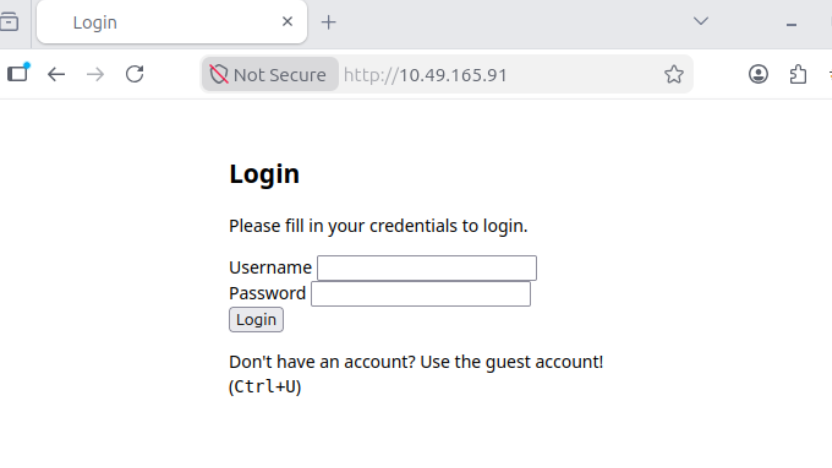
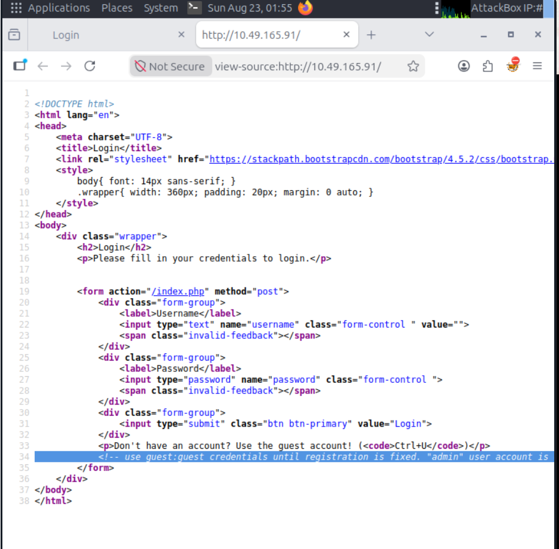
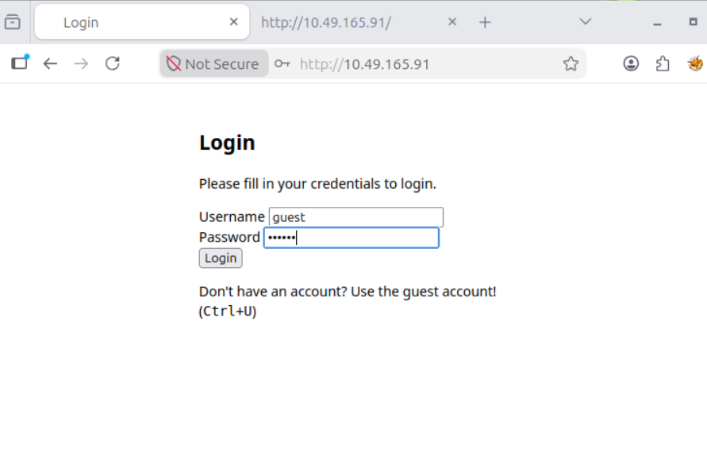
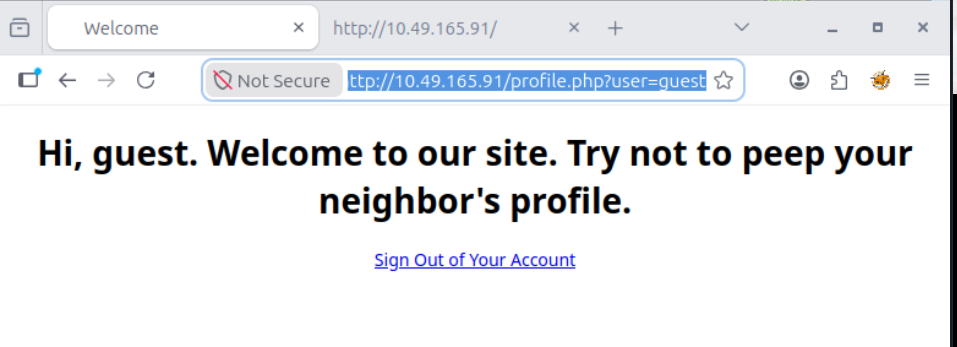
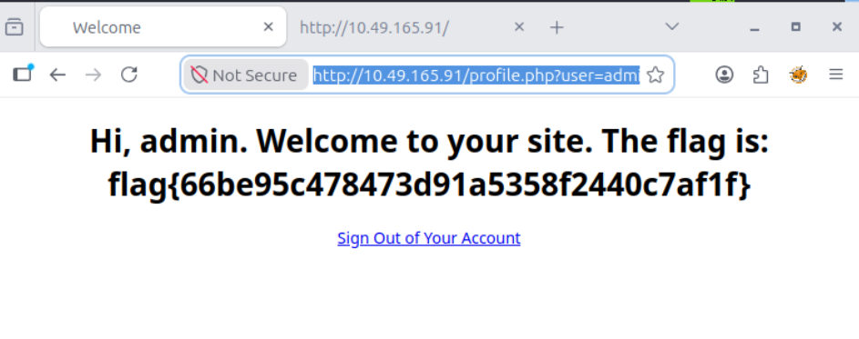

Let's dive into the issue.

Before diving into the website, let's understand what IDOR is.

## IDOR is a type of access control vulnerability where an attacker can access unauthorized data by manipulating user-supplied input, such as a URL parameter or an ID number.

---

Now, Start your attackbox and  Lab machine

Once you start the Lab machine that is your vulnerable website we are gonna exploit it,

Here in my case, htttp://10.49.165.91 is the vulnerability website

so now open firefox in you attackbox and visit the website,

So, now you can see a login page but we are told if you don't have a account you should use guest account 

 Right click , Let's see view page source or simple press (ctrl+U)

Here notice the line written in comment, we are told use guest:guest as credentials , admin is off limit so we type `guest:guest` as a username and password in login page 

Press login , or Enter

Now you will see a Welcome page , but pay attention to the URL

 

> profile.php file has a user parameter that reference using username. The admin elements can be accessed by other users by just changing the `profile.php?user=admin`

SO we will do the same thing here in URL change the `profile.php?user=guest` to `profile.php?user=admin`

NOW,we can see once we changed the user parameter we now can access the admin page as well and we have our flag

> The Flag : flag{66be95c478473d91a5358f2440c7af1f}

---

## Alish
