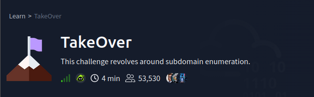
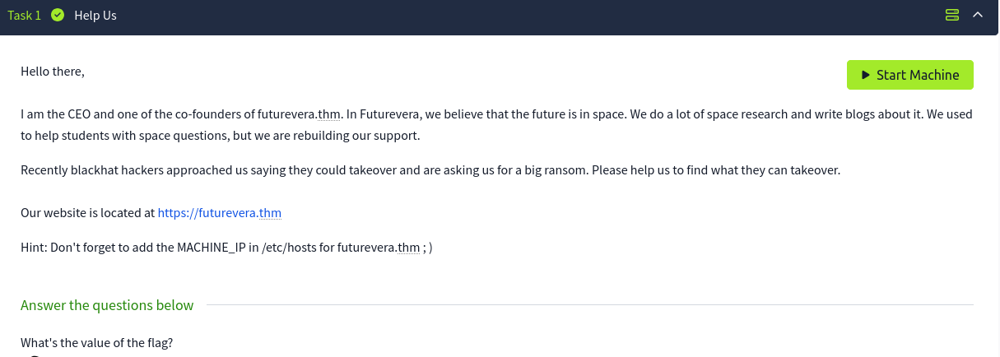
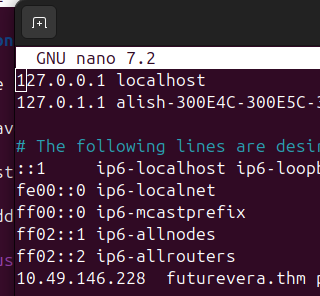
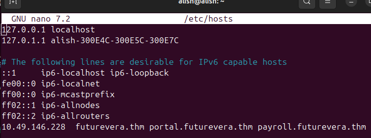
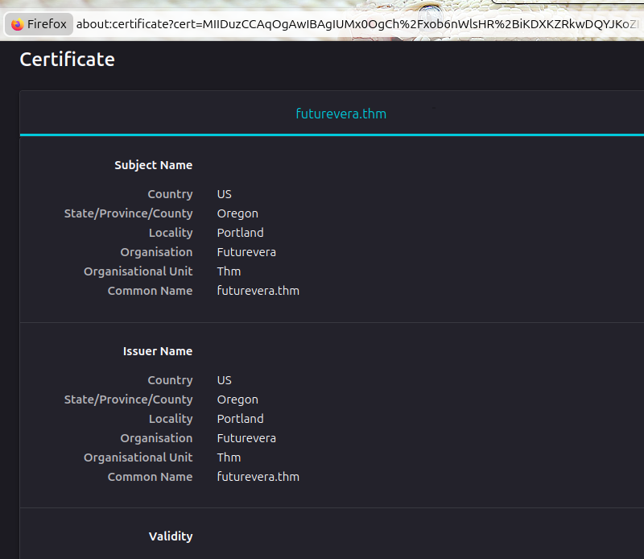
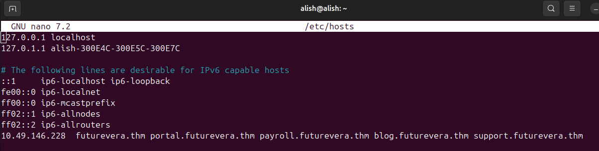
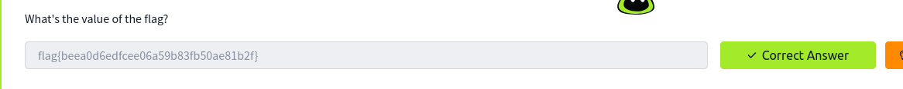

Hello let's dive straight to the issue,

---

If you will to see video : https://youtu.be/aWwzMVwBJdE?si=hc9UcuZdnXAPxnP8

---

If you are using Attackbox of TryHackMe then please ingnore this part, but if you are using your localmachine then yoi have do as mentioned

> First  you have to connect to the openvpn and configure with the configure file provided by <Tryhackme access> of you TyHackMe profile.

1. Intsall the openvpn if not installed `sudo apt update && sudo apt install openvpn easy-rsa`

2. once installed check with the command `openvpn --version` if installed you will see the openvpm verison installed in you machine .

3. now go to the <TryHackMe Access> there scroll down there will the download option of openvpn configuration file of your profile install it now,

4. Connect it with the configuration file which we downloaded go to the driver where the configuration is  stored  and run  `sudo openvpn your_configurationfile`

5. Go to TryHackMe Access where you downloaded the configuration file you will see a option <notconnected> to <connected>

> Now we are all set to solve the challange. 

---

Let's look at the task that we are given 

If you read we know that there is a website named Futurevera where space realted blogs and reading material where there they have been compromised by black hat hacker ok, the given website link is the root webiste which if you try to open it won't open 

So, we will have to look at other subdomain of the the webiste which might be key to us to look at what's going on

Go ahead and start the machine after 60 seoconds you will be given ip address of the website 

Once the IP address is given now add that to your `etc/hosts`

> But Why, cause this webiste is virutal hosting meaning one webiste has many servcies or products so adding the ip and website name we will able to acess through one ip address so yeah we mush do that 

1. Run `sudo nano /etc/hosts`
 
-  Go to the bottom of the file and add the `ip address   futurevera.thm`

For example,

2. Once added try to open if it does switch the protocol to <https> or <http> even when you switch high chance the website won't open even if it opens it is no use so we will have to find other subdomain and see through that,

3. we will use <fuzzer> They take a massive list of word and try then one by one against a target, we are gonna use fuzzers like

- ffuf (fuzz faster you fool)
- gobuster

> we will use ffuf to install use `sudo apt install ffuff` just installing this won't be enough you have to install wordlist as well so follow following steps,

- sudo apt update
- sudo apt install seclists -y
 
Now, go to where the <seclist> is located usually it is at `cd /usr/share/speclist` so now it is installed lets find the domain of the website we are given,

4. Open new terminal and Run 

- `ffuf -u https://futurevera.thm/ -H "HOST: FUZZ.futurevera.thm -w /usr/share/seclists/Discovery/DNS/subdomains-top1million-5000.txt -fs 0"`

so as you run this you will see subdomains that are open for this website

you will 2 subdomains open so we will add to our `/etc/hosts` so we can access the website

Now go to `sudo nano /etc/hosts` and add <portol.futurevera.thm> and <payroll.futurevera.thm>

5. Now go to the webiste check <https://portol.futurevera.thm> and <https://payroll.futurevera.thm>

the website is open but doesn't seem much of a help so we will see it's certificate if we can get something go to that lock icon and go to the secuirty option and see certificate 

if you scroll down you won't see much usefull things so 

Search for another subdonmain using our <ffuf> command earlier 

> You won't find another subdomains so now we will use socail engineer we know that there is <blog> page casue CEO has mentioned that they used to post blog and were building <support> so there must be  <blog and supoort page> lets try that

6.Lets add <blog> and <support> subdomain to our `etc/hosts`

now let's go to our blog page and see if we have some thing and same for the support page

Look likes there is othing in blog certificate too, let's see support page

If you see `https://support..futurevera.thm` and go to see its certificates and scroll down you will see <>

you will see a alternative name SAN (sundomain alternative name) if you sear the name iwth <https> or <http>

- http://SAN-you_will_find
OR,
- https://SAN-you_will_find

and if see at search box you will see a flag remove the uncesssary thinks and paste the flag,

---
***Alish***

